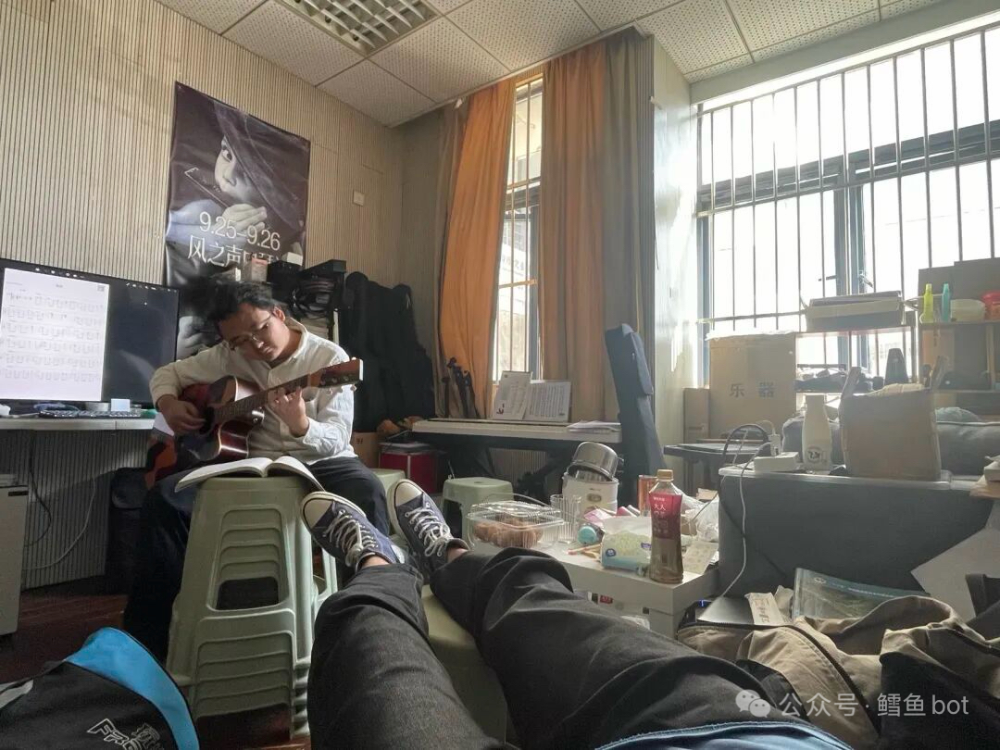
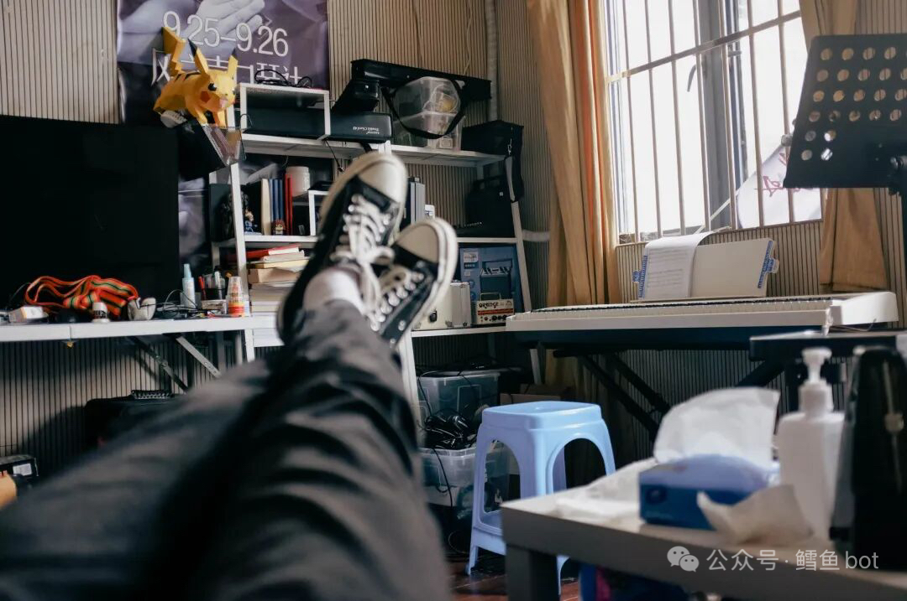
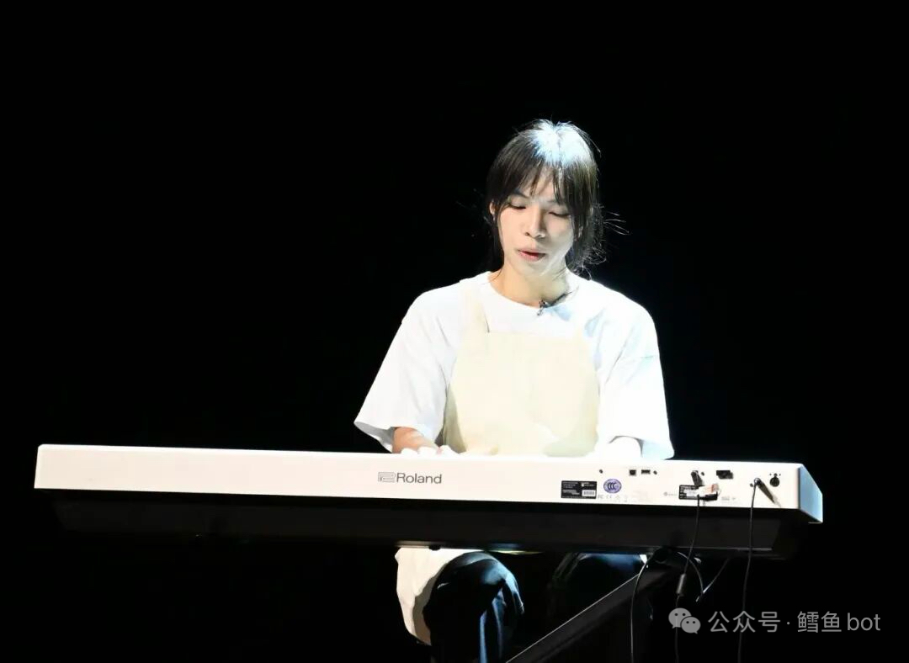
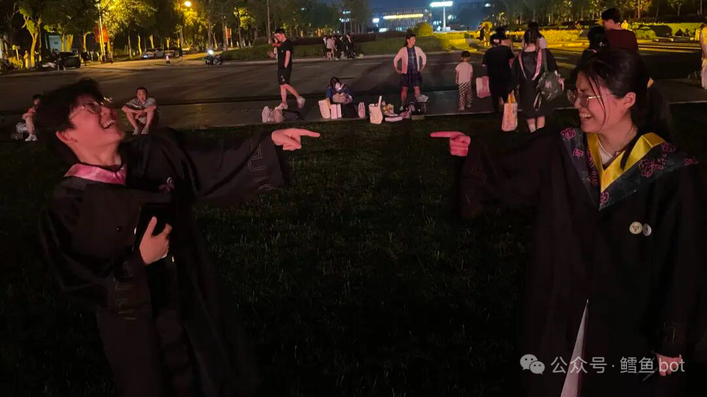
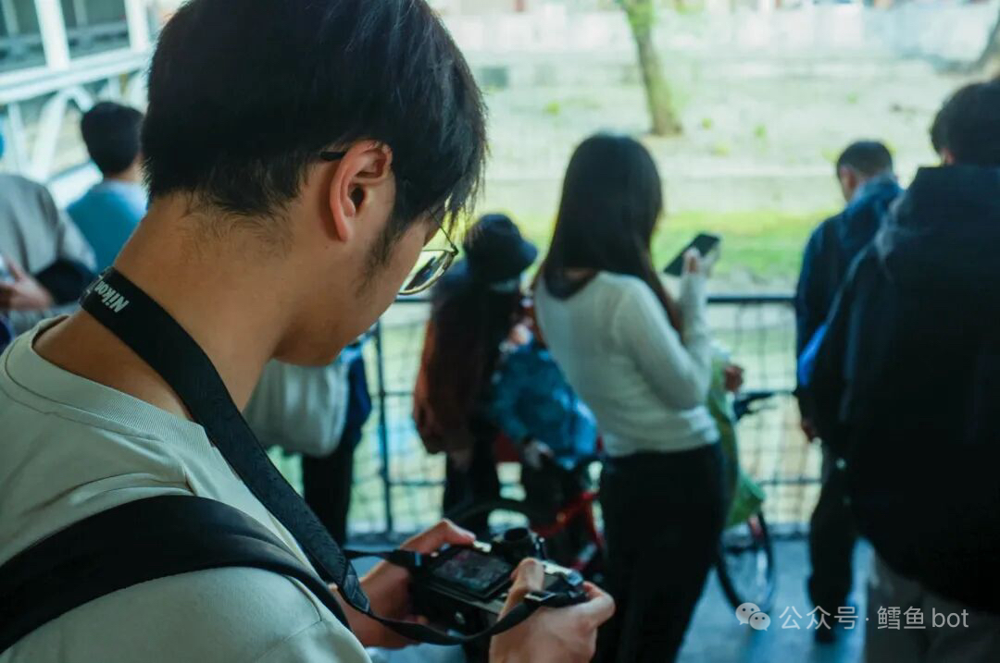
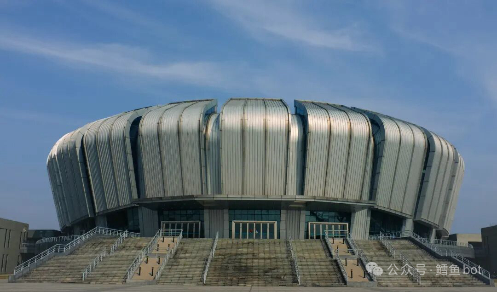

# 念

> 2023.3.15

我正躺着，眼睛闭着；风正吹着，吉他弹着。

时间如风一般，从我手里划过。你抓不住，它无孔不出，偷偷的改变着你和你身边的事。

但今天，我想留住时间。

---

*原标题《风》，修改于 2026.2.9*

*2023.3.15 冷兴澳在弹吉他*

*2024.4.2 我的生日*

*2023 刘权在舞台上为音乐剧伴奏，他像梦里的人*

*2023.6.19 《创世纪》*

*2024.5.21 和傅晟哲、Rae出去赏樱*

*2024.4.23 我拍的体育馆*

